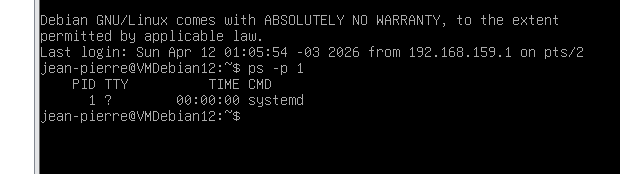
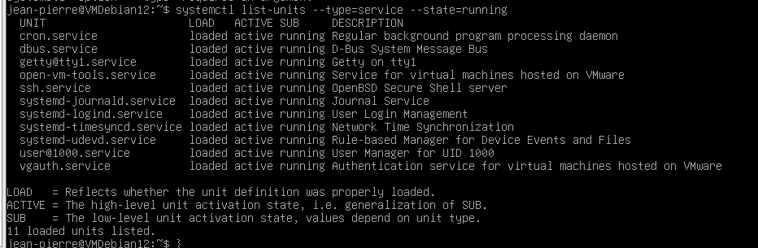
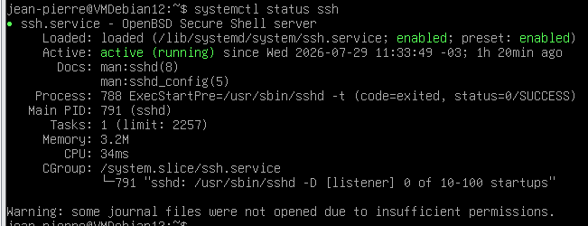
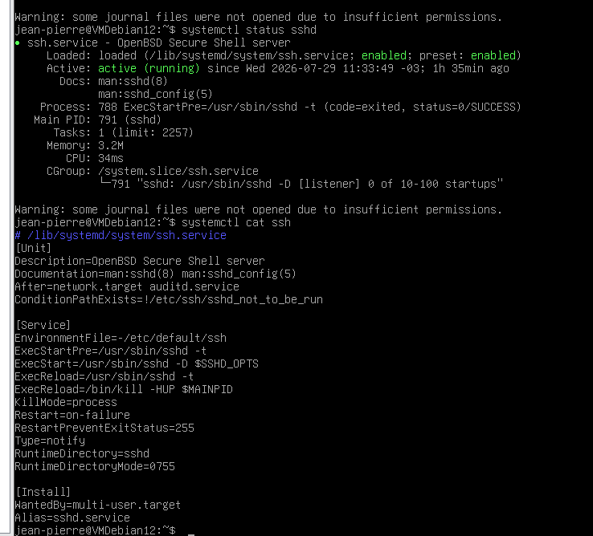
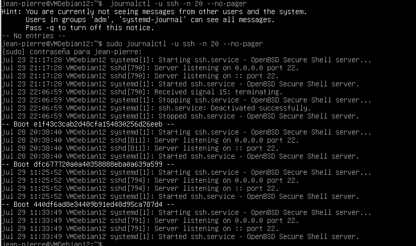
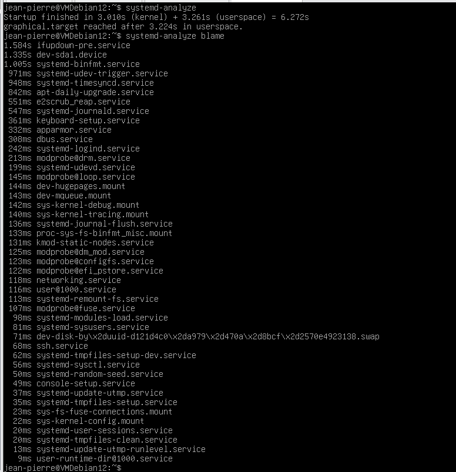
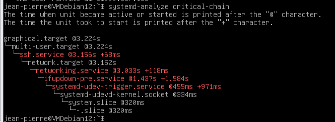
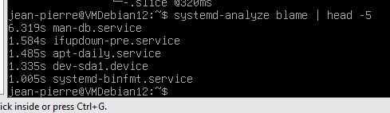

# Laboratorio 1 — Exploración del Ecosistema systemd

> **Unidad:** U1 — Gestión de Servicios con systemd  
> **Clase de referencia:** Clase 1 — Administración de Servicios en Linux  
> **Perfil:** A y B  


## Entorno

```
Sistema operativo : Debian 12
Shell             : bash
Usuario de trabajo: jean-pierre con sudo
Directorio        : /home/jean-pierre

---

## Paso 1 — Verificar el PID 1

**Concepto:** systemd es el primer proceso del espacio de usuario. Su PID es siempre 1.

```bash
ps -p 1
```

**Salida :**

```
 PID TTY          TIME CMD
1   ?            00:00:00 systemd

```

**Preguntas de análisis:**

1. ¿Qué proceso ocupa el PID 1 en tu sistema?
El proceso que ocupa el PID 1 en mi sistema es systemd, el administrador de servicios y procesos en Linux.


2. ¿Por qué el campo `TTY` muestra `?` en lugar de un terminal?

El campo TTY muesta ? por que ese proceso no está asociado a ningún terminal interactivo. systemd corre en segundo plano como proceso raíz del espacio de usuario.

3. Si el PID 1 muere, ¿qué le sucede al sistema? (responder con justificación técnica)

Si el PID 1 muere, el sistema entero se vuelve inestable y normalmente se detiene o entra en pánico, porque no hay ningún otro proceso que pueda asumir el rol de “init”. En Linux, PID 1 es responsable de adoptar procesos huérfanos y mantener el orden del sistema; sin él, el kernel no puede continuar la ejecución normal.

## Paso 2 — Auditoría de servicios activos

**Concepto:** `systemctl list-units` muestra el estado de todas las units cargadas por systemd.

```bash
systemctl list-units --type=service --state=running
```

**Variantes a ejecutar:**

```bash
# Ver todos los servicios (activos, inactivos, fallidos)
systemctl list-units --type=service --all

# Ver solo los servicios que fallaron
systemctl list-units --type=service --state=failed

# Contar servicios activos
systemctl list-units --type=service --state=running | grep -c "running"
```

**Preguntas de análisis:**



1. ¿Cuántos servicios están corriendo activamente?
 
11 servicios están corriendo activamente en mi sistema:
- cron.service: Daemon para tareas programadas (cron jobs).
- dbus.service: Bus de mensajes del sistema (comunicación entre procesos).
- getty@tty1.service: Proporciona login en la consola principal (tty1).
- open-vm-tools.service: Integración con VMware (porque tu VM está en ese entorno).
- ssh.service: Servidor SSH para acceso remoto.
- systemd-journald.service: Servicio de logging centralizado.
- systemd-logind.service: Gestión de sesiones de usuario y logins.
- systemd-timesyncd.service: Sincronización de hora vía NTP.
- systemd-udevd.service: Manejo de eventos de dispositivos.
- user@1000.service: Manager de sesión para tu usuario (UID 1000).
- vgauth.service: Autenticación para máquinas virtuales en VMware.


2. Identifica 3 servicios que sean parte del sistema base (no aplicaciones instaladas por el usuario). ¿Cómo los reconociste?

3 servicios que son parte del sistema base:

- systemd-journald.service (logging del sistema)
- systemd-logind.service (gestión de sesiones)
- systemd-udevd.service (gestión de dispositivos)

Se reconocen porque son parte del núcleo de systemd y no dependen de aplicaciones externas.


3. ¿Hay algún servicio en estado `failed`? Si es así, ¿cuál y por qué?

No, todos los servicios están en estado running. 
---

## Paso 3 — Análisis del ciclo de vida de un servicio

**Concepto:** `systemctl status` muestra el estado completo de un servicio: PID, cgroups, logs recientes y dependencias.

```bash
systemctl status ssh
```

> **Nota:** En algunos sistemas el servicio se llama `sshd`. Probar ambos si el primero falla.

```bash
# Alternativa
systemctl status sshd
```

**Identificar en la salida:**

| Campo a buscar | ¿Qué indica? |
|----------------|-------------|
| `Loaded:` | Si la unit file existe y está habilitada |
| `Active:` | Estado actual y tiempo en ese estado |
| `Main PID:` | PID del proceso principal |
| `CGroup:` | Árbol de cgroups y procesos hijos |
| `Tasks:` | Cantidad de hilos/procesos del servicio |

**Preguntas de análisis:**



1. ¿Cuánto tiempo lleva activo el servicio SSH?

El servicio SSH lleva corriendo aproximadamente 1 hora y 20 minutos desde el arranque.

2. ¿El servicio tiene procesos hijos? ¿Cuántos?
El Main PID es 791 (sshd), y dentro del CGroup se ve el proceso principal /usr/sbin/sshd -D. En este caso no aparecen procesos hijos adicionales, porque el servidor está en espera de conexiones. Cuando un cliente se conecta, se generan procesos hijos para manejar cada sesión.

3. ¿Qué significa `enabled` en la línea `Loaded:`?

En la línea Loaded: aparece enabled. Esto significa que el servicio está configurado para iniciarse automáticamente en cada arranque del sistema (está habilitado en el target multi-user.target).
---

## Paso 4 — Ingeniería inversa del unit file

**Concepto:** `systemctl cat` muestra el unit file tal como systemd lo carga, incluyendo fragmentos de override.

```bash
systemctl cat ssh
```


**Analizar las secciones:**

```bash
# Extraer solo las dependencias
systemctl cat ssh | grep -E "^(After|Requires|Wants|Before)"

# Ver con qué usuario corre el servicio
systemctl cat ssh | grep -E "^User"
```

**Preguntas de análisis:**

1. ¿Qué directiva define el comando de inicio? ¿Cuál es el valor?

La directiva de inicio (ExecStart=) define el comando que arranca el servicio. En mi salida aparece algo como:

ExecStart=/usr/sbin/sshd -D $SSHD_OPTS

Esto indica que el demonio SSH se ejecuta en modo daemon (-D) y puede recibir opciones adicionales.

2. ¿Qué targets o servicios debe iniciar ANTES que SSH? (`After=`)

Las dependencias (After=): El unit file especifica que SSH debe iniciarse después de servicios como network.target y auditd.service.

Esto asegura que la red esté disponible antes de levantar el servidor SSH.

3. ¿Tiene política de reinicio configurada (`Restart=`)? ¿Cuál?

Si mi sistema tiene política de reinicio (Restart=). Se suele ver Restart=on-failure.
Significa que si el proceso falla, systemd intentará reiniciarlo automáticamente.

4. ¿Tiene alguna directiva de hardening? ¿Cuál?

Si tiene Directivas de hardening: En la salida aparecen configuraciones como:

RuntimeDirectory=sshd para crear un directorio temporal seguro para el servicio.

RuntimeDirectoryMode=0755 que define permisos de ese directorio.

Estas medidas ayudan a aislar y proteger el servicio.

---

## Paso 5 — Auditoría de logs centralizados

**Concepto:** `journalctl` es la interfaz para el journal de systemd. Todos los logs de servicios pasan por journald.

```bash
# Últimas 20 líneas del servicio SSH
journalctl -u ssh -n 20 --no-pager
```

**Variantes a ejecutar:**

```bash
# Solo errores de SSH
journalctl -u ssh -p err --no-pager

# Logs del boot actual
journalctl -u ssh -b --no-pager

# Logs en tiempo real (Ctrl+C para salir)
journalctl -u ssh -f
```


**Preguntas de análisis:**

1. ¿Cuántas conexiones SSH se registraron en los últimos logs?

Conexiones registradas: En los últimos registros se ven eventos de inicio y detención del servicio SSH, además de mensajes de que está escuchando en el puerto 22. No aparecen intentos de conexión de clientes en esas últimas 20 líneas, solo actividad del propio demonio.

2. ¿Hay intentos fallidos de autenticación? ¿Cómo los identificaste?

No se observan ntentos fallidos de autenticación en este bloque. Cuando ocurren, se verían entradas como Failed password for ... o Invalid user ....

3. ¿Qué diferencia hay entre los logs con prioridad `info` y los de prioridad `err`?


Los logs de prioridad info reflejan eventos normales (inicio del servicio, escucha en puerto, cierre ordenado) mientras los de prioridad err indicarían problemas (fallos de autenticación, errores de configuración, caídas del proceso).

---

## Paso 6 — Profiling del arranque

**Concepto:** `systemd-analyze` mide el tiempo de cada fase del arranque y permite identificar cuellos de botella.

```bash
# Tiempo total de arranque
systemd-analyze

# Ranking de servicios por tiempo de inicio
systemd-analyze blame
```

**Variantes a ejecutar:**

```bash
# Cadena crítica (ruta más larga del grafo de dependencias)
systemd-analyze critical-chain

# Ver los 5 servicios más lentos
systemd-analyze blame | head -5
```






**Preguntas de análisis:**

1. ¿Cuánto tiempo tardó el sistema en arrancar en total? (kernel + initrd + userspace)

Tiempo total de arranque: Startup finished in 3.010s (kernel) + 3.261s (userspace) = 6.272s

El sistema arrancó en 6.27 segundos en total, lo cual es bastante rápido.

2. ¿Cuál es el servicio que más tiempo consume al iniciar? ¿Tiene sentido que tarde ese tiempo?

El Servicio más lento es man-db.service con 6.319s.

Este servicio actualiza la base de datos de las páginas de manual.

Tiene sentido que tarde más porque no es crítico para el arranque inmediato del sistema, sino una tarea de mantenimiento que se ejecuta en segundo plano.

3. ¿Qué servicio aparece en la cadena crítica (`critical-chain`)? ¿Por qué es "crítico"?

Los servicios que aparecen en la cadena crítica (critical-chain)son:

- ssh.service @3.156s +68ms
- network.target @3.152s
- networking.service @3.033s +118ms
- ifupdown-pre.service @1.437s +1.584s
- systemd-udev-trigger.service @455ms +971ms
- systemd-udevd-kernel.socket @334ms

Esto muestra que SSH depende de la red, y la red depende de ifupdown-pre.service, que a su vez depende de udev.

La cadena crítica refleja la ruta más larga de dependencias que deben cumplirse antes de que el sistema alcance el estado multiusuario/gráfico. En mi caso, el cuello de botella está en ifupdown-pre.service (1.584s), porque sin red inicializada no puede arrancar SSH ni otros servicios que dependen de conectividad.

---

## Actividad de Cierre — Mapa de Servicios

1. Identificar al menos 5 servicios activos en el sistema completando la siguiente tabla :

| Nombre del servicio     | Función                       | Estado | Tiempo de arranque |
|-------------------------|-------------------------------|--------|--------------------|
| ssh.service             | Acceso remoto SSH             |running | 68ms               |
|systemd-journald.service | Logging centralizado          |running | 547ms              |
| systemd-logind.service  | Gestión de sesiones de usuario|running | 243ms              |
| dbus.service            | Bus de mensajes del sistema   |running | 308ms              |
| cron.service            | Tareas programadas            |running |(no listado, <100ms)|
|open-vm-tools.service    | Integración con VMware|running|(no listado, rápido)|

2. Clasificarlos por función: red, seguridad, logging, base del sistema, aplicación

Red: ssh.service, open-vm-tools.service
Seguridad: systemd-logind.service (gestión de logins), ssh.service (acceso remoto seguro)
Logging:systemd-journald.service
Base del sistema:dbus.service, systemd-logind.service, systemd-journald.service
Aplicación: cron.service (programación de tareas), open-vm-tools.service (integración VM)

3. Indicar cuál podría deshabilitarse en un servidor de producción (sin romper el sistema)

De los 5 servicios listados en la tabla, el que podría deshabilitarse en un servidor de producción sin romper el sistema es cron.service. cron.service es útil para tareas programadas, pero no es crítico para el funcionamiento básico del servidor. Si no tienemos scripts o jobs programados, puede deshabilitarse sin afectar la estabilidad del sistema.

man-db.service (aunque no está en la tabla, vimos que consume 6.3s en el arranque) puede deshabilitarse en un servidor de producción sin afectar el funcionamiento, ya que solo actualiza la base de datos de páginas de manual. 

---